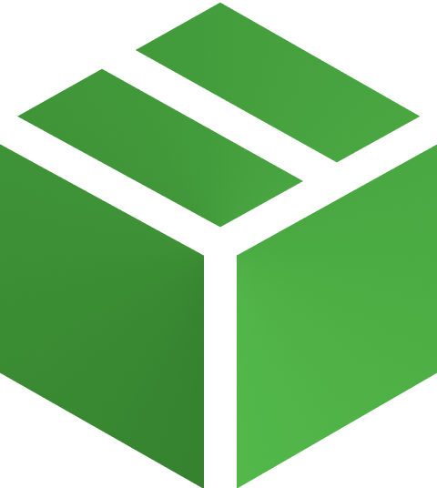

<div align="center">
  <a href="https://github.com/S6-BikePack">
    
  </a>
  <h1>BikePack - Customer-Service</h1>

  <p>
    Part of the S6 BikePack project.
  </p>


<!-- Badges -->
[](https://github.com/S6-BikePack/customer-service/actions/workflows/golangci-lint.yml)
[](https://github.com/S6-BikePack/customer-service/actions/workflows/run-tests.yml)
[](https://github.com/S6-BikePack/customer-service/actions/workflows/build.yml)

<h4>
    <a href="https://github.com/S6-BikePack">Home</a>
  <span> · </span>
    <a href="https://github.com/S6-BikePack/customer-service#-about-the-project">Documentation</a>
  <span> · </span>
    <a href="https://github.com/S6-BikePack/infrastructure#-about-the-project">Infrastructure</a>
  </h4>
</div>

<br />

<!-- Table of Contents -->
# 📓 Table of Contents

- [About the Project](#-about-the-project)
    * [Tech Stack](#%EF%B8%8F-tech-stack)
    * [Environment Variables](#-environment-variables)
- [Getting Started](%EF%B8%8F-getting-started)
    * [Prerequisites](%EF%B8%8F-prerequisites)
    * [Running Tests](#-running-tests)
    * [Run Locally](#-run-locally)
    * [Deployment](#-deployment)
- [Usage](#-usage)


<!-- About the Project -->
## ⭐ About the Project

The Customer-Service is the service for the BikePack project that handles all customers in the system.


<!-- TechStack -->
### 🛰️ Tech Stack
#### Language
  <ul>
    <li><a href="https://go.dev/">GoLang</a></li>
</ul>

#### Dependencies
  <ul>
    <li><a href="https://github.com/gin-gonic/gin">Gin</a><span> - Web framework</span></li>
    <li><a href="https://github.com/swaggo/swag">Swag</a><span> - Swagger documentation</span></li>
    <li><a href="https://gorm.io/index.html">GORM</a><span> - ORM library</span></li>
  </ul>

<!-- Env Variables -->
### 🔑 Configuration

This service can be configured using environment variables or a json file. The location of the file can be passed to the `config` environment variable.

The following configuration is available:

```json
{
    "server": {
      "service": "string",
      "port": "string",
      "description": "string"
    },
    "rabbitMQ": {
      "host": "string",
      "port": "int",
      "user": "string",
      "password": "string",
      "exchange": "string"
    },
    "database": {
      "host": "string",
      "port": "int",
      "user": "string",
      "password": "string",
      "database": "string",
      "debug": "bool"
    }
}
```

<!-- Getting Started -->
## 	🛠️ Getting Started

<!-- Prerequisites -->
### ‼️ Prerequisites

Building the project requires Go 1.18.

The easiest way to setup the project is to use the Docker-Compose file from the infrastructure repository.

<!-- Running Tests -->
### 🧪 Running Tests

The tests in the project can easily be run using make and the `make run-tests` command. This will start the required docker containers and run all tests in the project.

<!-- Run Locally -->
### 🏃 Run Locally

Clone the project

```bash
  git clone https://github.com/S6-BikePack/customer-service
```

Go to the project directory

```bash
  cd customer-service
```

Run the project (Rest)

```bash
  go run cmd/rest/main.go
```


<!-- Deployment -->
### 🚀 Deployment

To build this project run (Rest)

```bash
  go build cmd/rest/main.go
```


<!-- Usage -->
## 👀 Usage

### REST
Once the service is running you can find its swagger documentation with all the endpoints at `/swagger`